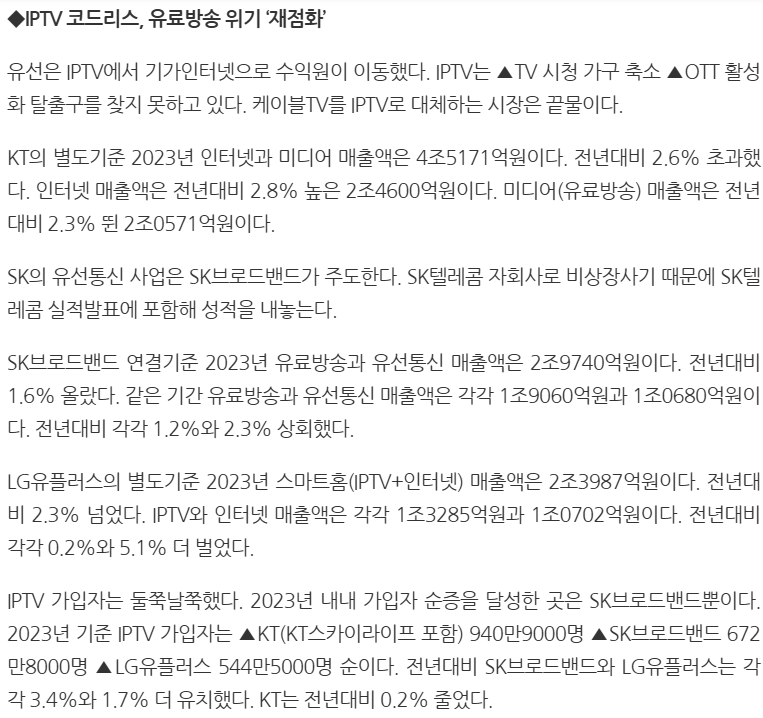
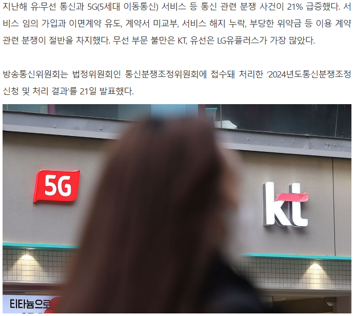

# SKN14-2nd-1Team

# 👣팀 소개

## 팀명 - 빛나레인저 or 이탈하지말아조

<table>
  <tr>
    <th>김재아</th>
    <th>박빛나</th>
    <th>이승철</th>
    <th>하종수</th>
    <th>한승규</th>
  </tr>
  <tr>
    <td></td>
    <td></td>
    <td></td>
    <td></td>
    <td></td>
  </tr>
  <tr>
    <td></td>
    <td></td>
    <td></td>
    <td></td>
    <td></td>
  </tr>
</table>

# 📄 데이터셋 개요
🛰️ 인터넷 구독 서비스 이용객 이탈률 예측 데이터 셋

Internet Service Provider Customer Churn - 
"https://www.kaggle.com/datasets/mehmetsabrikunt/internet-service-churn"

선택이유 - 1인 가구 증가, 통신사의 데이터 서비스 및 신뢰감 변화등으로 인해 인터넷 구독에 관한 소비자의 선택 폭이 다양해지고 있다. 이러한 상황에서
회사는, 기존 고객을 붙잡고 새로운 고객을 유치하며, 이탈 고객을 다시 돌아오게 해야 한다. 이러한 방안을 제안하기 위해, 고객 이탈률을 예측하여 대안 방안을 제시 할 예정이다.

인터넷(유선)사용량 변화

 서비스 유지 보수 문제 

## 🧮 데이터프레임 구조
총 행 수 (entries): 72,274

총 열 수 (columns): 11

메모리 사용량: 약 6.1 MB

| 열 이름                          | Not null 값 | 데이터 타입  |
| ----------------------------- |------------| ------- |
| `id`                          | 72,274     | int64   |
| `is_tv_subscriber`            | 72,274     | int64   |
| `is_movie_package_subscriber` | 72,274     | int64   |
| `subscription_age`            | 72,274     | float64 |
| `bill_avg`                    | 72,274     | int64   |
| `reamining_contract`          | 50,702     | float64 |
| `service_failure_count`       | 72,274     | int64   |
| `download_avg`                | 71,893     | float64 |
| `upload_avg`                  | 71,893     | float64 |
| `download_over_limit`         | 72,274     | int64   |
| `churn`                       | 72,274     | int64   |

📏 데이터프레임 크기
(행, 열) = (72,274, 11)

# 🗂️ 컬럼 설명

| 컬럼명                           | 설명                                                      |
| ----------------------------- | ------------------------------------------------------- |
| `id`                          | 고유 구독자 ID                                               |
| `is_tv_subscriber`            | TV 구독 여부                                                |
| `is_movie_package_subscriber` | 영화 패키지 구독 여부                                            |
| `subscription_age`            | 구독 기간                                                   |
| `bill_avg`                    | 지난 3개월 평균 청구 금액                                         |
| `reamining_contract`          | 계약의 남은 연수 (Null일 경우 계약 없음, 계약 종료 전 해지 시 위약금 발생)      |
| `service_failure_count`       | 지난 3개월간 서비스 장애로 인한 콜센터 고객 통화 횟수                         |
| `download_avg`                | 지난 3개월 평균 다운로드 사용량 (GB)                                 |
| `upload_avg`                  | 지난 3개월 평균 업로드 사용량 (GB) ※ 다운로드 및 업로드 평균 사용량은 3GB 제한 내 |
| `download_over_limit`         | 지난 9개월 동안 다운로드 제한 초과 횟수 ※ 초과 시 추가 요금 발생              |
| `churn`                       | 서비스 취소 여부                                               |

## 데이터 전처리 및 Feature Engineering

### 결측값 전처리

 - Col[reamining contract]항목 -> [remaining contract]로 수정(오타)

 - [remaining contract] 결측치 = 21572

 - download_avg, upload_avg 결측치 381

📌 remaining_contract 변수에 대한 해석 및 처리 기준

remaining_contract는 **계약의 남은 기간(연 단위)**을 의미하며,
NaN은 "계약 기간이 없는 경우"로 이해됨.

이탈자의 경우 remaining_contract를 0으로 간주해도 무방.

하지만 이탈하지 않았지만 값이 NaN인 경우, 이는 실제 결측치(missing value)로 판단하는 것이 더 타당함.

🔍 0 값의 의미 분석
연 단위로 환산 시, 1일 ≈ 0.00274

따라서 remaining_contract = 0.01은 약 3.6일, 즉 4일 정도를 의미함.

이 데이터셋에서는 4일 이상 남은 경우만 0.01 이상의 값으로 표기,
4일 미만은 모두 0으로 표기된 것으로 보임.

✅ 결론 및 처리 기준
remaining_contract = 0인 경우는 계약 만료 임박 또는 종료 상태로 판단 가능.

실제로 **해당 값들의 churn은 거의 1(이탈)**로 나타나므로,
0도 NaN과 마찬가지로 계약 종료 상태로 간주하는 것이 타당함.

### ⚙️Feature Engineering
- 현재 TV 구독, 영화 구독에 대해 각각 이탈 or 유지만 분석함,
- 하지만, TV 구독과 영화 구독을 둘 다 하지 않는 경우, 둘 다 하는 경우, 하나만 하는 경우로 데이터들이 기록되어있기 때문에 새롭게 subscription_status 라는 column을 만들어서
0. : 구독 없음
1. : TV 구독
2. : 영화 구독
3. : 둘 다 구독

과 같은 형태로 새로 만드는 방법으로 새롭게 상관성을 찾고 시각화하여  확인하는게 좋지 않을까 라는 의문에서 새로운 컬럼 생성

# 머신 러닝을 위한 모델 및 스케일러 선택

## 📊 사용 모델 설명 및 적합성

| 모델                                  | 설명                                                                | 데이터셋과의 적합성                                                               |
| ----------------------------------- | ----------------------------------------------------------------- | ------------------------------------------------------------------------ |
| **XGBClassifier**                   | Gradient Boosting 기반의 고성능 트리 모델. 정교한 에러 보정과 regularization 기능 포함. | 다수의 이진 범주형 및 수치형 데이터가 혼합되어 있고, 결측값 처리와 학습 속도가 뛰어나 실무에서 churn 예측에 자주 사용됨. |
| **CatBoostClassifier**              | 범주형 변수 자동 처리에 최적화된 Gradient Boosting 모델.                          | 이 데이터셋은 이진형 변수들이 많아 CatBoost의 자동 인코딩 기능이 매우 유리함. 튜닝 없이도 성능이 우수.          |
| **SVC (Support Vector Classifier)** | 데이터 간 경계를 최대한 넓히는 초평면을 찾는 모델. 고차원에서 효과적.                          | 피처 수가 과도하지 않으며, 이진 분류 문제로 적합. 하지만 스케일러에 민감하여 적절한 전처리가 매우 중요함.            |
| **RandomForestClassifier**          | 여러 결정 트리를 앙상블해 예측 정확도를 높이는 모델. 과적합에 강하고 해석도 용이.                   | 변수 간 상호작용을 잘 잡으며, 결측치가 있는 상태에서도 비교적 견고하게 작동함.                            |
| **LogisticRegression**              | 고전적인 선형 모델. 해석력이 뛰어나고 구현이 간단.                                     | 기준선 모델(Baseline)로 매우 적절. 스케일 조정에 민감하지만 간단한 문제의 경우에도 유의미한 결과를 낼 수 있음.     |

## 🧪 사용 스케일러 설명 및 적합성

| 스케일러                    | 설명                                               | 데이터셋과의 적합성                                                                                                |
| ----------------------- | ------------------------------------------------ | --------------------------------------------------------------------------------------------------------- |
| **None**                | 전처리 없이 원본 그대로 사용.                                | 기준선 비교용. 어떤 모델이 스케일에 민감한지 파악할 수 있음.                                                                       |
| **StandardScaler**      | 평균 0, 표준편차 1로 정규화. 정규 분포 가정이 있는 모델에 적합.          | `subscription_age`, `bill_avg`, `download_avg` 등의 값들이 정규 분포에 가까울 경우 효과적. SVC, LogisticRegression 등과 잘 작동. |
| **MinMaxScaler**        | 모든 값을 \[0, 1] 범위로 조정. 이상치에 민감.                   | 대부분 피처가 정해진 범위를 가지므로 잘 작동할 수 있으나, 이상치(outlier)에는 취약.                                                      |
| **RobustScaler**        | 중앙값과 IQR을 기준으로 스케일링. 이상치에 강건.                    | `bill_avg`나 `service_failure_count`처럼 이상값이 있을 수 있는 변수에 적합.                                                |
| **MaxAbsScaler**        | 최대 절대값을 기준으로 -1\~1 범위로 스케일. 희소 행렬에 적합.           | 이진 변수 또는 0에 가까운 데이터가 많을 경우 유리하지만, 이 데이터셋에는 제한적인 장점.                                                       |
| **QuantileTransformer** | 데이터를 정규 분포 또는 균등 분포로 변환. 이상치를 제거하면서 모델 성능 향상 가능. | 비정규 분포 데이터에 강력하고, 특히 Logistic/SVC와 같은 스케일 민감 모델에 효과적.                                                     |

## ✅ 요약 추천

스케일러가 중요한 모델: SVC, LogisticRegression

스케일러 없이도 잘 작동하는 모델: XGBClassifier, CatBoost, RandomForest

범주형/이진형 특성 고려: CatBoost 매우 유리

해석 가능성과 속도 고려: LogisticRegression, RandomForest 적합

고성능과 일반화: XGBClassifier, CatBoost 우수

# 모델의 성능지표 확인

## 사전조건

1. 결측치는 0으로 대체하여 진행한다.
2. 하이퍼 파라미터는 random_state = 42만 사용하여 모든 모델을 고정하고 비교한다.
2. ['id'] 컬럼은 학습에 필요 없으니 제거한다.
3. ['remaining_contract'] 컬럼은 과적합의 우려가 있어 비교하기 위해 컬럼을 유지한 것과 삭제한 것을 비교한다.
4. Feature Engineering으로 인한 Label 값과, 중복 학습을 일으킬 수 있는 ['is_tv_subscriber', 'subscription_status_label', 'is_movie_package_subscriber'] 컬럼 또한 제거하여 학습한다.
5. 적합한 모델을 확인하기 위해 사전에 5가지 모델의 6가지 스케일의 값을 비교하여 최적의 스케일링인 Quantiltransformer와 스케일링을 하지 않은 값을 비교한다.

## 📊 이탈 예측 모델 성능 비교 (하이퍼 파라미터 X)

✅ remaining_contract 유지 + Quantiltransformer

| Model               | Precision    | Recall       | F1-score     | Accuracy     | ROC AUC      |
| ------------------- | ------------ | ------------ | ------------ | ------------ | ------------ |
| CatBoost            | **0.946964** | 0.941792     | 0.944371     | 0.938516     | **0.978397** |
| XGBoost             | 0.946423     | **0.945537** | **0.945980** | **0.940159** | 0.978164     |
| Random Forest       | 0.946780     | 0.938358     | 0.942550     | 0.936614     | 0.976256     |
| Logistic Regression | 0.849964     | 0.915886     | 0.881695     | 0.863801     | 0.931560     |
| SVM                 | 0.851464     | 0.875780     | 0.863451     | 0.846506     | 0.922671     |

✅ remaining_contract 유지 + 스케일링 없음

| Model               | Precision    | Recall       | F1-score     | Accuracy     | ROC AUC      |
| ------------------- | ------------ | ------------ | ------------ | ------------ | ------------ |
| CatBoost            | **0.946964** | 0.941792     | 0.944371     | 0.938516     | **0.978397** |
| XGBoost             | 0.946423     | **0.945537** | **0.945980** | **0.940159** | 0.978164     |
| Random Forest       | 0.946780     | 0.938358     | 0.942550     | 0.936614     | 0.976256     |
| Logistic Regression | 0.849964     | 0.915886     | 0.881695     | 0.863801     | 0.931560     |
| SVM                 | 0.851464     | 0.875780     | 0.863451     | 0.846506     | 0.922671     |

✅ remaining_contract 제거 + Quantiltransformer

| Model               | Precision    | Recall       | F1-score     | Accuracy     | ROC AUC      |
| ------------------- | ------------ | ------------ | ------------ | ------------ | ------------ |
| CatBoost            | 0.861735     | **0.819913** | 0.840304     | 0.827309     | **0.905883** |
| XGBoost             | **0.864379** | 0.817572     | **0.840324** | **0.827828** | 0.905477     |
| Random Forest       | 0.850670     | 0.802747     | 0.826014     | 0.812608     | 0.890576     |
| SVM                 | 0.801214     | 0.720818     | 0.758893     | 0.746195     | 0.822489     |
| Logistic Regression | 0.728006     | 0.789014     | 0.757283     | 0.719734     | 0.803120     |

✅ remaining_contract 제거 + 스케일링 없음

| Model               | Precision    | Recall       | F1-score     | Accuracy     | ROC AUC      |
| ------------------- | ------------ | ------------ | ------------ | ------------ | ------------ |
| CatBoost            | 0.861735     | **0.819913** | 0.840304     | 0.827309     | **0.905883** |
| XGBoost             | **0.864379** | 0.817572     | **0.840324** | **0.827828** | 0.905477     |
| Random Forest       | 0.850670     | 0.802747     | 0.826014     | 0.812608     | 0.890576     |
| SVM                 | 0.801214     | 0.720818     | 0.758893     | 0.746195     | 0.822489     |
| Logistic Regression | 0.728006     | 0.789014     | 0.757283     | 0.719734     | 0.803120     |

✔️ 최적의 머신러닝 학습 모델과 스케일러 결론

- ['remaining_contract'] 컬럼을 삭제하지 않았을 때, 높은 점수를 얻을 수 있지만 과적합 우려로 인해 삭제하고 학습하는 것이 좋다.
- 컬럼을 삭제했을 때의 점수는 XGBoost 모델이 1등, 그 다음을 CatBoost 모델이 잇고 있다.
- 현재의 데이터 셋에 XGBoost와 CatBoost, 두 모델을 사용하고 하이퍼 파라미터를 수정하여 더 높은 값을 찾아내야 한다.

